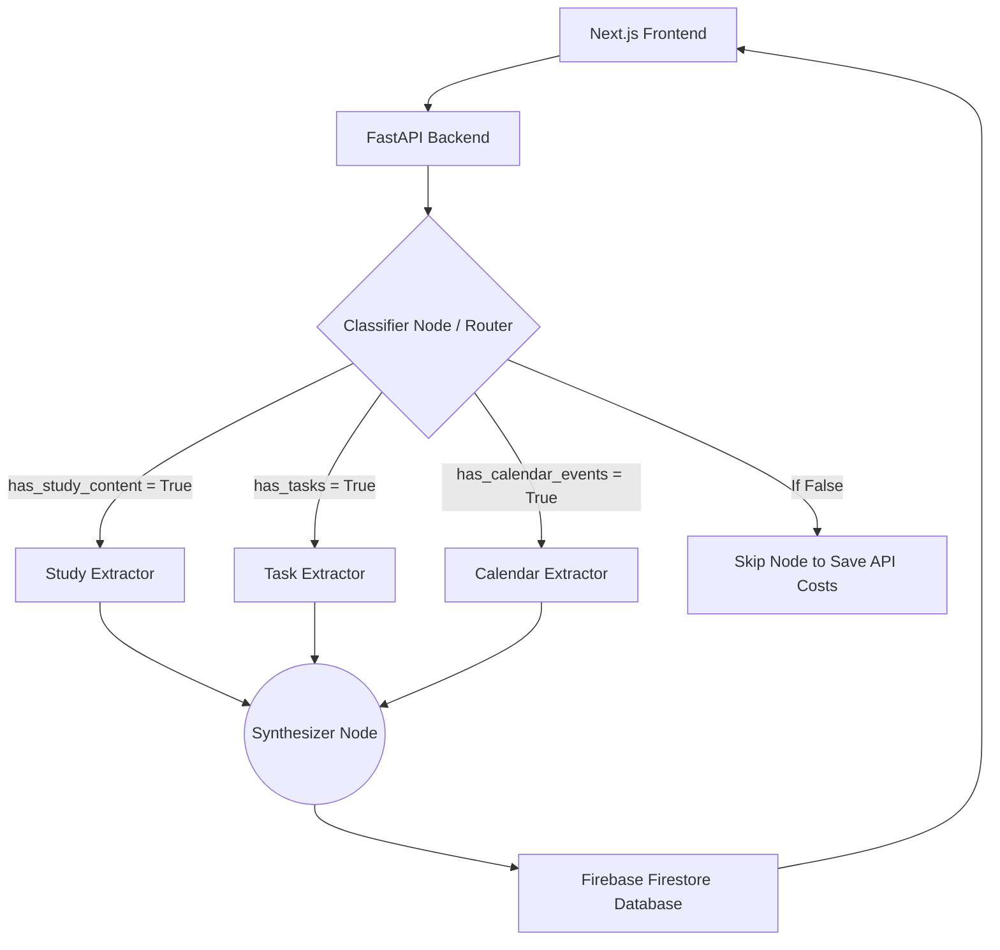

# No-Look Contextual Note Taker


### Watch the Demo Video

https://www.youtube.com/watch?v=gX3CAM0IWCk

The No-Look Contextual Note Taker solves a deeply human problem: chaotic, unstructured, panicked brain dumps. Whether you are running late to class and typing a disorganized paragraph, or speaking a panicked voice memo into your phone, this agentic application listens, untangles your thoughts, and organizes them perfectly.

## Features
- **No-Look Brain Dumps**: Paste completely chaotic text with mixed topics, hidden deadlines, and typos.
- **Multimodal Voice Support**: Drag and drop raw audio files (.mp3, .wav). The backend natively transcribes and processes your voice using Gemini 2.5.
- **Multi-Agent Orchestration**: Powered by LangGraph, the application dynamically routes data. A Classifier Node analyzes your input and only triggers the necessary extraction nodes (Study, Task, Calendar), saving processing time and API costs.
- **Structured Pydantic Outputs**: The Large Language Model is constrained to return strict JSON structures, guaranteeing the user interface never experiences data inconsistencies.
- **Persistent Organizer Hub**: Built with Next.js and Firebase, the application acts as a permanent dashboard where tasks and events stack up until you manually interact with them.
- **Authentication**: Secure access using Firebase Authentication, supporting unique Usernames and Google OAuth integration.

## System Architecture

The application is structured as a full-stack web application with a Next.js frontend and a FastAPI backend. The core logic is powered by a multi-agent Directed Acyclic Graph (DAG) orchestrated using LangGraph.

### Architecture Flowchart


### In-Depth Component Breakdown

1. **Frontend (Next.js & React)**
   - Provides a highly responsive and modern user interface styled with Tailwind CSS.
   - Manages state globally and handles interactions with Firebase Authentication for user identity management.

2. **Backend (FastAPI & Python)**
   - Exposes RESTful endpoints to process incoming unstructured text and audio files.
   - Interfaces directly with the Google Gemini API to analyze multimodal inputs.

3. **Classifier Node (Router)**
   - Acts as the orchestrator within the LangGraph workflow.
   - Classifies the input against a predefined schema to evaluate flags (has_tasks, has_calendar_events, has_study_notes).
   - Utilizes conditional edges to trigger only necessary extraction nodes, bypassing irrelevant nodes to optimize latency.

4. **Parallel Extraction Agents**
   - Each extractor is a specialized agent bound to a strict output schema.
   - Task Extractor: Extracts to-do items, urgency levels, and categories.
   - Calendar Extractor: Identifies meeting names, dates, times, and durations.
   - Study Extractor: Synthesizes educational concepts, definitions, and summaries.

## Deployment Guide

The application is designed to be deployed across two separate hosting platforms: Render for the backend and Vercel for the frontend.

### 1. Backend Deployment (Render)
1. Push the repository to GitHub.
2. Log into Render and create a new Web Service.
3. Select the repository and set the Root Directory to `backend`.
4. Ensure the Build Command is `pip install -r requirements.txt` and the Start Command is `uvicorn main:app --host 0.0.0.0 --port $PORT`.
5. Deploy the service and copy the resulting production URL.

### 2. Frontend Deployment (Vercel)
1. Log into Vercel and import the GitHub repository.
2. Set the Root Directory to `frontend`.
3. In the Environment Variables section, add `NEXT_PUBLIC_API_URL` and set its value to the Render backend URL you copied previously.
4. Deploy the application.

## How to Run Locally

### Backend Setup
1. Open a terminal and navigate to the backend directory:
   ```bash
   cd backend
   ```
2. Create and activate a virtual environment:
   ```bash
   python -m venv venv
   source venv/bin/activate
   ```
3. Install the required dependencies:
   ```bash
   pip install -r requirements.txt
   ```
4. Start the FastAPI server:
   ```bash
   uvicorn main:app --reload --port 8000
   ```

### Frontend Setup
1. Open a new terminal window and navigate to the frontend directory:
   ```bash
   cd frontend
   ```
2. Install the necessary Node packages:
   ```bash
   npm install
   ```
3. Start the Next.js development server:
   ```bash
   npm run dev
   ```
4. The application will be accessible at `http://localhost:3000`.

## Future Enhancements
- **Export to Calendar**: Automated .ics generation to seamlessly add extracted events to Apple or Google Calendar.
- **Notion Integration**: Functionality to push the Study Notebook formatted markdown directly into a Notion database via API.
- **Gemini File API for Large Media**: Upgrading the ingestion node to utilize the Gemini File API, allowing users to upload massive one-hour .mp4 lecture videos instead of strictly short audio memos.
