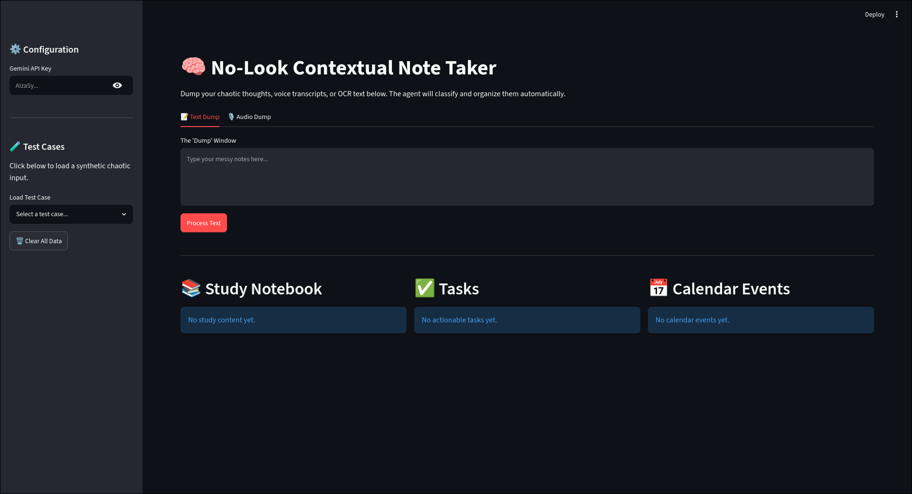

# No-Look Contextual Note Taker



### 🎥 Watch the Demo Video
*(Drag and drop your video.mp4 here in the GitHub editor!)*

A highly advanced "Vibe Coding" capstone project built for the Gemini Developer Competition.

The **No-Look Contextual Note Taker** solves a deeply human problem: chaotic, unstructured, panicked brain dumps. Whether you are running late to class and typing a disorganized paragraph, or speaking a panicked voice memo into your phone, this agentic app listens, untangles your thoughts, and perfectly organizes them.

## Features
- **"No-Look" Brain Dumps**: Paste completely chaotic text with mixed topics, hidden deadlines, and typos.
- **True Multimodal Voice Support**: Drag and drop raw `.mp3` or `.wav` files. The agent natively transcribes and processes your voice using Gemini 2.5.
- **Multi-Agent Orchestration**: Powered by **LangGraph**, the app dynamically routes data. A Classifier Node analyzes your input and only triggers the necessary extraction nodes (Study, Task, Calendar), saving time and API costs.
- **Structured Pydantic Outputs**: The LLM is forced to return strict JSON structures, guaranteeing the UI never hallucinates or breaks.
- **Persistent Organizer Hub**: Built with Streamlit, the app acts as a permanent dashboard where tasks and events stack up until you manually check them off.

## Architecture
The app leverages a state-graph architecture via LangGraph:
1. `raw_input` (Audio/Text) -> **Classifier Node** (Gemini)
2. **Router** determines what data is present.
3. Parallel execution of **StudyExtractor**, **TaskExtractor**, and **CalendarExtractor**.
4. **Synthesizer** combines structured JSON and passes it to the Streamlit UI.

## How to Run Locally

1. **Clone the repository:**
   ```bash
   git clone https://github.com/yourusername/no-look-note-taker.git
   cd no-look-note-taker
   ```

2. **Set up a virtual environment:**
   ```bash
   python -m venv venv
   source venv/bin/activate
   ```

3. **Install dependencies:**
   ```bash
   pip install -r requirements.txt
   ```

4. **Run the app:**
   ```bash
   streamlit run app.py
   ```

5. **API Key Setup:**
   Grab a free API key from Google AI Studio and paste it directly into the Streamlit sidebar to start processing!

## Future Enhancements
- **Export to Calendar**: One-click `.ics` generation to automatically add extracted events to Apple/Google Calendar.
- **Notion Integration**: Directly push the "Study Notebook" formatted markdown into a Notion database via API.
- **Gemini File API for Large Videos**: Upgrade the ingestion node to use the Gemini File API, allowing users to upload massive 1-hour `.mp4` lecture videos instead of just short audio memos.

---
*Built with love using LangGraph, Streamlit, and Google Gemini 2.5.*
